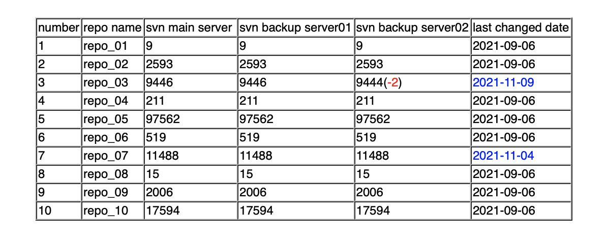

# Svn revision compare
Consistency check between svn server and backup severs.

Compare the revisions between svn server and backup severs, and send email notification.

# PreRequire tools
- Python2.7 or Python3
- SVN cli
  
# About svn auth
SVN username and password should be added to svn cli option for authentication. 

In addition，add 2 parameters to `～/.subversion/servers` file as follows:
```
store-passwords = yes
store-plaintext-passwords = yes
```

# How to run
## Run task on local machine
1. Modify configuration parameters in `settings.py`
2. Execute script： `python svn_revision_compare.py`

## Run task with docker
1. Modify configuration parameters in `settings.py`
2. Build docker image: `docker build -t svn_revison_compare:v1 .`
3. Run container: `docker run -d svn_revison_compare:v1`

# Email demo screenshot

